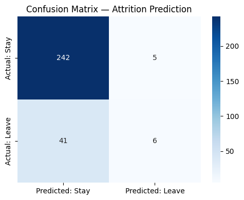
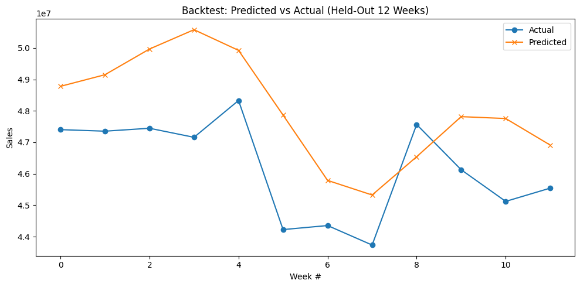

# 📊 Data Analytics Portfolio Projects
**Author:** Preeti Bhatiya

This repository contains two comprehensive projects demonstrating my skills in **Data Cleaning**, **Machine Learning**, and **Time-Series Forecasting**.

---

## 📂 Project 1: Employee Attrition Analysis
**Goal:** Identify why employees leave the company and build a predictive model.

### 🔹 Key Findings
* **Top Factors:** My analysis revealed that **YearsAtCompany** and **NumCompaniesWorked** are the strongest predictors of attrition. Surprisingly, salary had less impact than tenure.
* **Model:** Trained a **Random Forest Classifier** on a stratified 80/20 train-test split (stratification ensures the train and test sets preserve the same attrition ratio as the full dataset).

### 🔹 Model Evaluation
The dataset is imbalanced (~16% attrition rate), so accuracy alone is misleading. Full evaluation:

| Metric | Baseline Model | `class_weight='balanced'` |
|---|---|---|
| Accuracy | 84.4% | 83.7% |
| Precision | 54.5% | 44.4% |
| Recall | 12.8% | 8.5% |
| F1-score | 20.7% | 14.3% |

The baseline model correctly identified only 6 of 47 actual leavers (low recall), despite high overall accuracy — a classic symptom of class imbalance. I tested `class_weight='balanced'` as a mitigation, but it did not improve recall, likely because Random Forest's bagging structure means class weighting affects individual tree splits without strongly shifting the final ensemble vote. With more time, I'd explore SMOTE oversampling, classification threshold tuning, or models where class weighting has a more direct effect (e.g. Logistic Regression).

### 🔹 Dashboard Output

### 🔹 Confusion Matrix

---

## 📂 Project 2: Sales Forecasting
**Goal:** Predict future sales trends to assist with inventory planning using the Walmart dataset.

### 🔹 Key Findings
* **Seasonality:** The model detected a massive surge in sales every **November/December**, aligning with the holiday season.
* **Weekly Trends:** Sales volume peaks early in the week and dips on Fridays.
* **Forecast:** Generated a 12-week future forecast with a 95% confidence interval using Facebook Prophet, with weekly and yearly seasonality enabled.

### 🔹 Model Validation
Before trusting the future forecast, I backtested the model: held out the last 12 weeks of known data, trained only on data prior to that period, forecasted forward, and compared predictions against actual values.

**MAPE (Mean Absolute Percentage Error) on held-out 12-week period: 4.36%**

A MAPE under 10% is generally considered strong for retail sales forecasting, and under 5% is very good — this validates the model's reliability before relying on its forecast for future planning.

### 🔹 Backtest: Predicted vs. Actual

### 🔹 Forecast Output

### 🔹 Seasonal Components

---

### 🛠 Tools Used
* **Python**: Pandas, NumPy, Matplotlib, Seaborn
* **Machine Learning**: Scikit-Learn (Random Forest), Facebook Prophet
* **Platform**: Google Colab

### 💾 Data Sources
* **Attrition Data:** [IBM HR Analytics on Kaggle](https://www.kaggle.com/datasets/pavansubhasht/ibm-hr-analytics-attrition-dataset)
* **Sales Data:** [Walmart Recruiting - Store Sales Forecasting](https://www.kaggle.com/c/walmart-recruiting-store-sales-forecasting/data)
